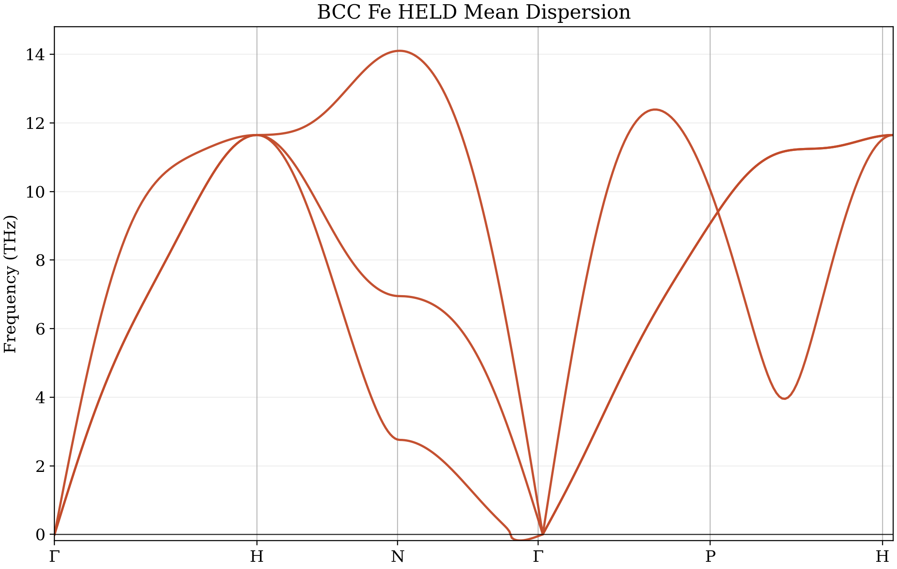
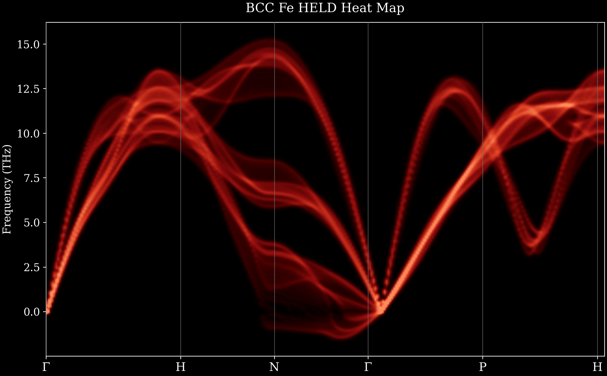
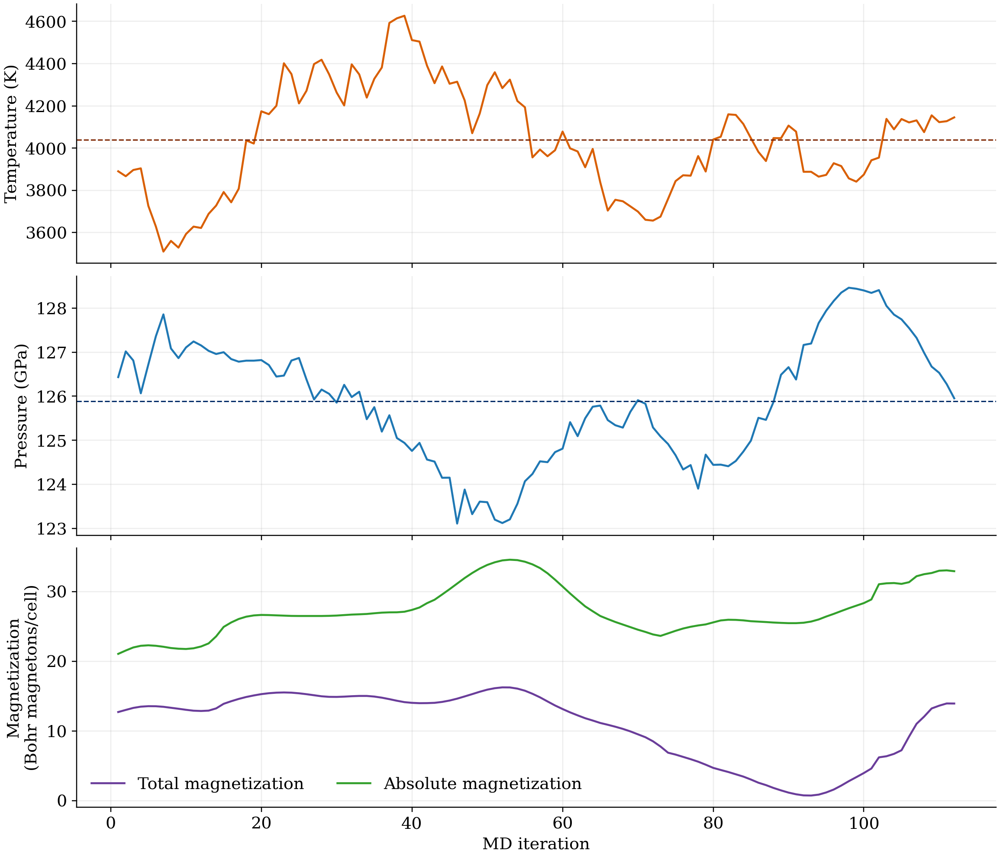

# HELD


Harmonic Ensemble Lattice Dynamics: Finite-temperature phonon dispersions from MD-based force constants.


The main code is `HELD.py`. It supports:

- `fit`: fit HELD coefficients from an NPZ trajectory (Now but it will support md-trajectories from Quantum Espresso and LAMMPS in the near future)
- `dispersion`: compute and plot the mean HELD dispersion along a built-in high-symmetry path
- `heatmap`: compute and plot the HELD dispersion heat map from all fitted frames


## Current scope

- The current unified implementation is phase-generic and element-generic for single-element datasets such as Fe, Ni, Co, or Al.
- The code infers the primitive cell and supercell repetition directly from the NPZ geometry, so the workflow is not tied to hardcoded Fe paths.
- Example iron runs and plots are stored under `examples/iron/`.
- The notebook `notebooks/iron_three_phase_examples.ipynb` shows one `bcc`, one `fcc`, and one `hcp` Fe case using `skip=100` and `aggregate="mean"`.
- The unified code currently reads normalized NPZ trajectories only. A direct general-purpose Quantum ESPRESSO or LAMMPS importer is not part of the unified workflow yet.

## Animated Iron Examples

### BCC Fe


### FCC Fe


### HCP Fe


## Install

```bash
cd /path/to/HELD
/opt/anaconda3/bin/python -m pip install -r requirements.txt
```

## How to use HELD on your own material

1. Prepare a trajectory in the NPZ format described below.
2. Choose the phase with `--phase bcc`, `--phase fcc`, or `--phase hcp`.
3. Run `fit` to obtain the HELD coefficients.
4. Run `dispersion` to compute the mean dispersion.
5. Run `heatmap` to compute the HELD intensity map from the per-frame coefficients.

Minimal usage:

```bash
/opt/anaconda3/bin/python HELD.py fit \
  --phase bcc \
  --npz /path/to/case.npz \
  --output-csv results/held_case.csv \
  --output-steps-csv results/held_case_steps.csv \
  --aggregate mean \
  --skip 100
```

```bash
/opt/anaconda3/bin/python HELD.py dispersion \
  --phase bcc \
  --npz /path/to/case.npz \
  --held-csv results/held_case.csv \
  --output-data results/held_case_dispersion.dat \
  --output-plot results/held_case_dispersion.png
```

```bash
/opt/anaconda3/bin/python HELD.py heatmap \
  --phase bcc \
  --npz /path/to/case.npz \
  --held-csv results/held_case.csv \
  --cache-npz results/held_case_heatmap_steps.npz \
  --output-plot results/held_case_heatmap.png
```

If you want a different standard symmetry path, pass it explicitly. Example:

```bash
/opt/anaconda3/bin/python HELD.py dispersion \
  --phase bcc \
  --npz /path/to/case.npz \
  --held-csv results/held_case.csv \
  --output-data results/held_case_dispersion.dat \
  --output-plot results/held_case_dispersion.png \
  --path GM-H-N-GM-P-H
```

When `--output-steps-csv` is provided, HELD writes a companion table without changing the coefficient-only CSV consumed by `dispersion` and `heatmap`. Each selected frame contains:

- the zero-based source-frame index,
- the trajectory iteration,
- time in ps when available,
- temperature in K,
- pressure in GPa,
- total magnetization in Bohr magnetons per cell,
- absolute magnetization in Bohr magnetons per cell,
- and all fitted HELD coefficients for that frame.

Missing observables are written as `nan`, so the same option can be used with magnetic and non-magnetic trajectories.

## Collinear-magnetic BCC example

`examples/iron/bcc_collinear_4000K/run_case.py` runs the new `128`-atom collinear BCC trajectory in `../dataset/bcc/magnetic-collinear/`. It replaces the displaced initial structure in `simulation.npz` with the ideal BCC reference from `simulation-ideal.npz`, while preserving the full updated trajectory, forces, temperature, pressure, and magnetization arrays. The HELD-specific copy also maps the artificial per-atom QE labels (`A01`, `A02`, and so on) back to the physical element symbol `Fe`.

Run it from the HELD repository:

```bash
/opt/anaconda3/bin/python examples/iron/bcc_collinear_4000K/run_case.py
```

The example writes the mean dispersion, heatmap, step-resolved HELD/thermodynamic CSV, a temperature-pressure-magnetization diagnostic plot, and a JSON summary under `examples/iron/bcc_collinear_4000K/`.

The current run uses all `112` valid frames. It has a mean temperature of `4038.6 K`, a mean pressure of `125.88 GPa`, a mean total magnetization of `10.82` Bohr magnetons/cell, and a mean absolute magnetization of `27.32` Bohr magnetons/cell.







## Required NPZ format

The unified loader currently expects the following fields:

- `input_cell_parameters`
  The simulation cell in angstrom.
- `input_cell_unit`
  Must be `angstrom` or `ang`.
- `positions`
  Shape `(n_frames, n_atoms, 3)`, stored in fractional crystal coordinates.
- `positions_unit`
  Must be `crystal`.
- `initial_positions_alat`
  Ideal atomic positions used as the reference configuration.
- `initial_cell_alat`
  Cell associated with `initial_positions_alat`.
- `forces_ry_au`
  Shape `(n_frames, n_atoms, 3)`, stored in Ry/Bohr.
- `symbols`
  One chemical symbol per atom.
- `iteration`
  Optional frame index array. If omitted, HELD uses `0, 1, 2, ...`.

Minimal NPZ creation pattern:

```python
import numpy as np

np.savez_compressed(
    "case.npz",
    input_cell_parameters=cell_ang,
    input_cell_unit=np.array("angstrom"),
    positions=positions_frac,
    positions_unit=np.array(["crystal"] * len(positions_frac)),
    initial_positions_alat=ideal_positions_reference,
    initial_cell_alat=ideal_cell_reference,
    forces_ry_au=forces_ry_bohr,
    symbols=np.array(symbols),
    iteration=np.arange(len(positions_frac), dtype=int),
)
```

## If you do not have an NPZ yet

If your data currently comes from Quantum ESPRESSO or LAMMPS, the practical workflow is:

1. Extract the ideal reference structure.
2. Extract the MD positions and forces for every saved frame.
3. Keep the same atom ordering in every frame.
4. Convert all positions to fractional crystal coordinates.
5. Convert all forces to Ry/Bohr.
6. Save the trajectory as the NPZ schema above.
7. Run `HELD.py` on that NPZ.

### Quantum ESPRESSO

For Quantum ESPRESSO trajectories, the main work is usually bookkeeping, not physics:

- Read the cell for each frame or the fixed MD cell if the run is NVT with a fixed box.
- Convert the frame positions to fractional coordinates in the same cell basis.
- Forces from QE are often already close to the expected Ry/Bohr convention, but you should verify the exact output units for your workflow before writing `forces_ry_au`.
- Use the same atom order in the ideal structure and in every MD frame.

### LAMMPS

For LAMMPS, the current unified code does not yet provide a general importer, so the recommended route is conversion to the NPZ format first.

- If your dump files use `metal` units, positions are usually in angstrom and forces are usually in eV/angstrom.
- Convert positions from cartesian angstrom to fractional crystal coordinates with the simulation cell matrix.
- Convert forces from eV/angstrom to Ry/Bohr before saving them as `forces_ry_au`.
- The conversion factor used by HELD is:

```python
RY_TO_EV = 13.605693122994
BOHR_TO_ANG = 0.529177210903
RY_PER_BOHR_TO_EV_PER_ANG = RY_TO_EV / BOHR_TO_ANG
forces_ry_bohr = forces_ev_ang / RY_PER_BOHR_TO_EV_PER_ANG
```


## Recommended checks before running HELD

- Confirm that all frames use the same atom ordering.
- Confirm that `positions` are fractional crystal coordinates, not cartesian coordinates.
- Confirm that the cell is in angstrom.
- Confirm that `forces_ry_au` really is in Ry/Bohr.
- Confirm that the dataset is single-element if you are using the current unified code.
