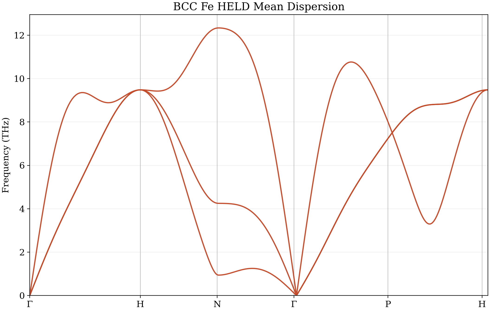
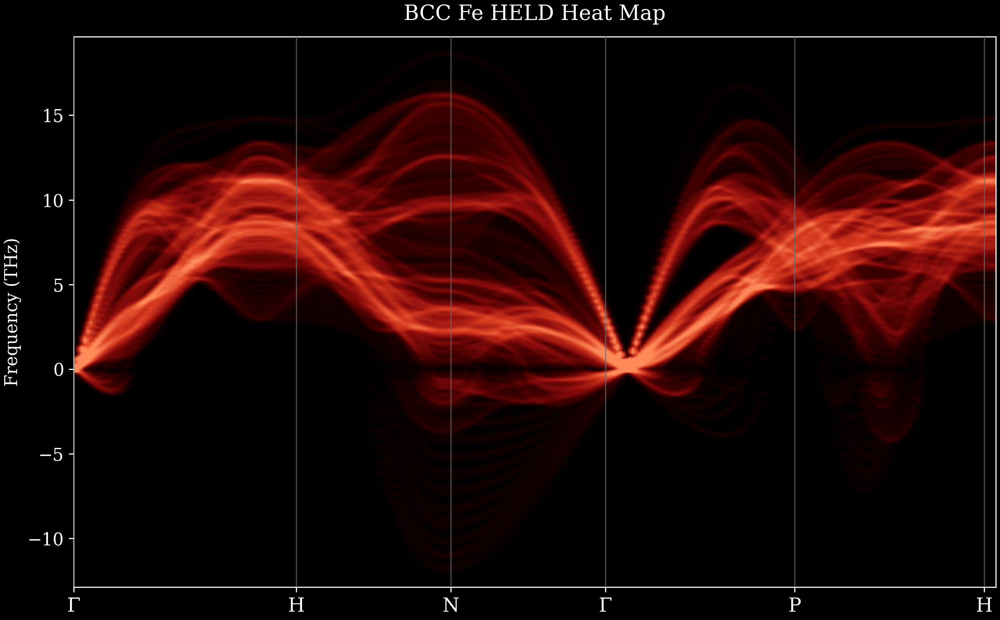
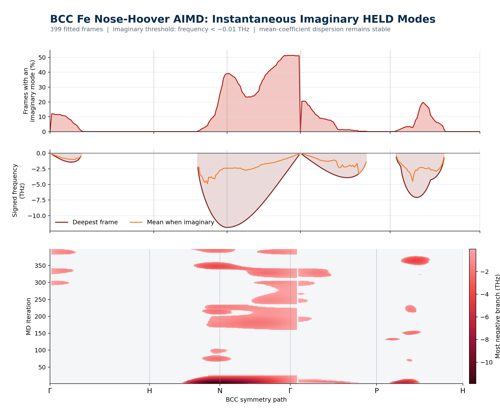
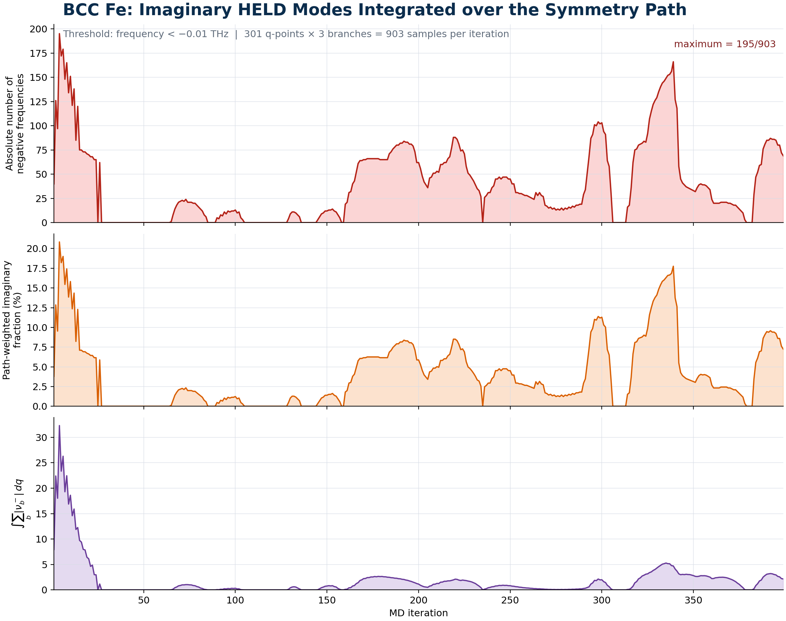
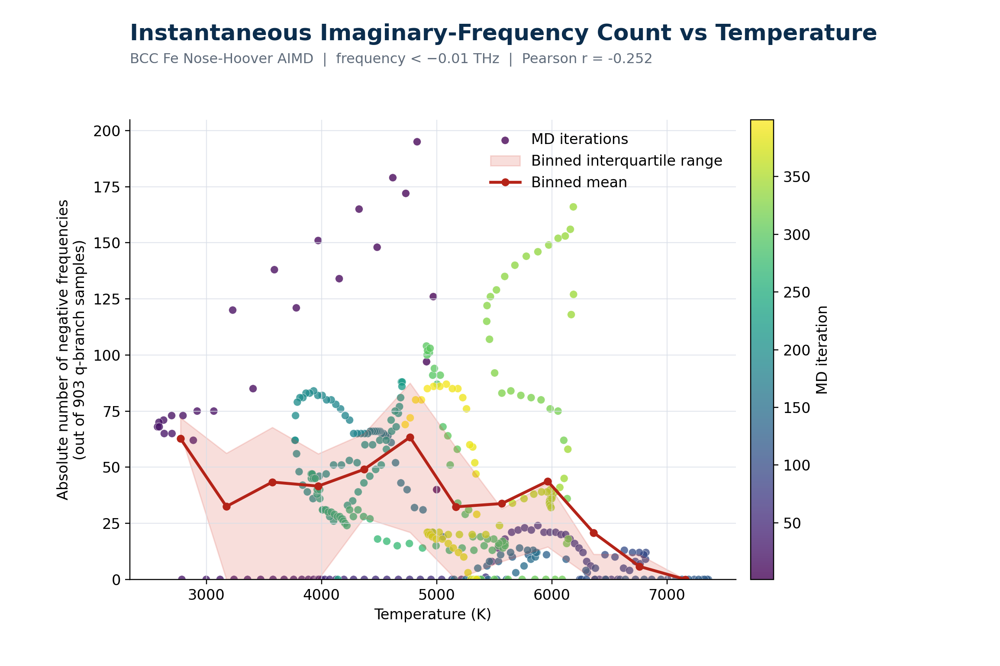

# BCC Fe at 5000 K with a Nose-Hoover thermostat

This self-contained example applies HELD to a Quantum ESPRESSO molecular
dynamics trajectory of BCC iron at a target temperature of 5000 K.

## Simulation and HELD settings

- phase: BCC Fe
- atoms: 128
- supercell: 4 x 4 x 4 conventional BCC cells
- cell length: 10.0400 angstrom
- conventional lattice parameter: 2.5100 angstrom
- thermostat: Nose-Hoover
- printed MD configurations: 400
- complete position-force frames used by HELD: 399
- fitted interaction shells: 5
- coefficient aggregate: arithmetic mean
- symmetry path: Gamma-H-N-Gamma-P-H

The QE output contains positions for iterations 1 through 400. Iteration 400
does not have a following force evaluation, so it is retained in the parsed
trajectory but excluded automatically from the HELD fit.

## Reproduce the analysis

Install the dependencies from the repository root and run:

```bash
python -m pip install -r requirements.txt
python examples/iron/bcc_nose_5000K/run_case.py
python examples/iron/bcc_nose_5000K/make_animated_dispersion.py
python examples/iron/bcc_nose_5000K/plot_imaginary_qpoints.py
python examples/iron/bcc_nose_5000K/plot_imaginary_count_by_iteration.py
python examples/iron/bcc_nose_5000K/plot_imaginary_count_vs_temperature.py
```

`run_case.py` uses the included `qe_output_parser.py`, so the workflow does
not depend on code outside this repository.

## Main phonon result

The mean-coefficient HELD dispersion is stable along the sampled symmetry
path and spans approximately 0 to 12.33 THz. Instantaneous frame fits contain
negative signed frequencies from -11.89 to 18.63 THz overall.





## Imaginary-mode analysis

Frequencies below -0.01 THz are classified as imaginary for the diagnostic
plots.

- 307 of 399 frames contain at least one instantaneous imaginary mode.
- 179 of 301 sampled q-points become imaginary in at least one frame.
- the most negative mode is -11.89 THz at iteration 4 and the N point.
- the maximum per-frame count is 195 of 903 q-point/branch samples.
- the maximum path-weighted imaginary fraction is 20.84 percent.
- the count-temperature Pearson correlation is -0.252.







The integer count depends on the 301-point symmetry-path sampling. The
path-weighted occurrence and magnitude integrals in
`held_imaginary_count_by_iteration.csv` are less sensitive to the sampling
density.

## Included files

- `fe1.out`: original Quantum ESPRESSO output
- `qe_output_parser.py`: local QE trajectory parser
- `run_case.py`: QE-to-NPZ conversion and complete HELD workflow
- `make_animated_dispersion.py`: 399-frame animated dispersion
- `plot_imaginary_qpoints.py`: q-resolved imaginary-mode report
- `plot_imaginary_count_by_iteration.py`: per-iteration path integration
- `plot_imaginary_count_vs_temperature.py`: temperature correlation
- `held_run_summary.json`: settings and numerical summary
- `simulation_parsed.npz` and `simulation_held.npz`: parsed and normalized data
- `held_mean_all_valid.csv`: mean and per-frame HELD coefficients
- `held_steps_with_thermodynamics.csv`: fitted coefficients and observables
- `held_heatmap_steps_all_valid.npz`: step-resolved frequency cache
- `bcc_Fe_nose_5000K_HELD_0001_0399.gif`: all-step animation

The PNG and CSV files in this directory are the corresponding publication and
machine-readable outputs.
